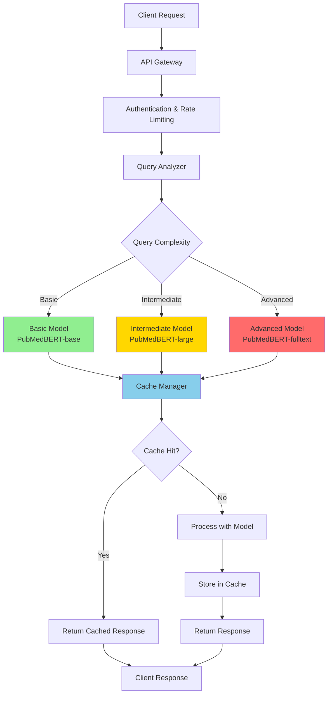

# Structural Heart LLM System

A cost-optimized Large Language Model (LLM) system specifically designed for the structural heart domain, featuring multiple model strategies, intelligent caching, and comprehensive cost optimization.

## 🏗️ Architecture Overview



## 🎯 Key Features

### 1. **Cost Optimization**
- **Multi-Model Strategy**: Uses different models based on query complexity
  - **Basic Model**: PubMedBERT-base for simple queries (lowest cost)
  - **Intermediate Model**: PubMedBERT-large for moderate complexity
  - **Advanced Model**: PubMedBERT-fulltext for complex medical queries
- **Intelligent Model Selection**: Automatically chooses the most cost-effective model
- **Cost Tracking**: Real-time cost estimation and monitoring

### 2. **Intelligent Caching**
- **Redis-based Caching**: Persistent cache for frequently asked queries
- **In-Memory Cache**: Fast access for hot queries
- **Cache Hit Optimization**: Significant cost and time savings
- **Cache Statistics**: Monitoring and analytics

### 3. **Query Analysis**
- **Complexity Scoring**: Analyzes query complexity using medical terminology
- **Structural Heart Domain**: Specialized for cardiac and valve-related queries
- **Medical Term Extraction**: Identifies anatomical and pathological terms
- **Confidence Scoring**: Provides confidence levels for recommendations

### 4. **Security & Monitoring**
- **API Key Authentication**: Secure access control
- **Rate Limiting**: Prevents abuse (100 requests/minute)
- **Prometheus Metrics**: Comprehensive monitoring
- **Structured Logging**: Detailed audit trails

## 🚀 Quick Start

### Prerequisites
- Python 3.8+
- Redis server
- 8GB+ RAM (for model loading)
- GPU recommended (for advanced models)

### Installation

1. **Clone the repository**
```bash
git clone https://github.com/your-username/LLM-for-structural-heart.git
cd LLM-for-structural-heart
```

2. **Install dependencies**
```bash
pip install -r requirements.txt
```

3. **Start Redis server**
```bash
# On macOS
brew install redis
brew services start redis

# On Ubuntu
sudo apt-get install redis-server
sudo systemctl start redis
```

4. **Run the application**
```bash
python main.py
```

5. **Access the API**
- API Documentation: http://localhost:8000/docs
- Health Check: http://localhost:8000/health
- Metrics: http://localhost:8000/metrics

## 📊 Usage Examples

### Basic Query Processing
```python
import requests

# Process a simple query
response = requests.post(
    "http://localhost:8000/query",
    headers={"Authorization": "Bearer your-api-key"},
    json={
        "query": "What is aortic valve stenosis?",
        "include_analysis": True
    }
)

print(response.json())
```

### Cost Estimation
```python
# Get cost estimate for different models
cost_analysis = requests.get(
    "http://localhost:8000/models/cost-estimate",
    params={"query": "Complex structural heart disease assessment"}
)
print(cost_analysis.json())
```

### Cache Management
```python
# Get cache statistics
cache_stats = requests.get("http://localhost:8000/cache/stats")
print(cache_stats.json())

# Clear cache
requests.delete("http://localhost:8000/cache/clear")
```

## 🔧 Configuration

### Environment Variables
Create a `.env` file in the project root:

```env
# Model Configuration
BASIC_MODEL_NAME=microsoft/BiomedNLP-PubMedBERT-base-uncased-abstract
INTERMEDIATE_MODEL_NAME=microsoft/BiomedNLP-PubMedBERT-large-uncased-abstract
ADVANCED_MODEL_NAME=microsoft/BiomedNLP-PubMedBERT-large-uncased-abstract-fulltext

# Cache Configuration
REDIS_URL=redis://localhost:6379
CACHE_TTL=3600
CACHE_MAX_SIZE=10000

# Security
API_KEY=your-secure-api-key
RATE_LIMIT_PER_MINUTE=100

# Monitoring
ENABLE_METRICS=true
METRICS_PORT=9090
```

### Model Registry
The system uses a tiered model approach:

| Model Tier | Use Case | Cost | Performance |
|------------|----------|------|-------------|
| Basic | Simple queries, definitions | Low | Fast |
| Intermediate | Clinical assessments | Medium | Balanced |
| Advanced | Complex diagnostics | High | Comprehensive |

## 🧪 Testing

### Run Unit Tests
```bash
pytest tests/ -v
```

### Run Integration Tests
```bash
pytest tests/ -m integration -v
```

### Run Examples
```bash
python examples/usage_examples.py
```

## 📈 Performance Monitoring

### Metrics Available
- **Request Count**: Total requests by model and status
- **Request Duration**: Processing time histograms
- **Cache Hit Rate**: Cache effectiveness
- **Cost Tracking**: Per-request cost analysis
- **Model Performance**: Load times and memory usage

### Health Checks
- Model loading status
- Cache connectivity
- API responsiveness
- Memory usage

## 🔒 Security Considerations

### Authentication
- API key-based authentication
- Bearer token validation
- Secure key management (use environment variables)

### Rate Limiting
- Per-client rate limiting
- Configurable limits
- Abuse prevention

### Data Protection
- No sensitive data logging
- Secure cache storage
- Input validation and sanitization

### Best Practices
1. **Use HTTPS** in production
2. **Rotate API keys** regularly
3. **Monitor access logs**
4. **Implement proper error handling**
5. **Use secure Redis configuration**

## 🏥 Medical Domain Features

### Structural Heart Terminology
The system recognizes and processes:
- **Valve Anatomy**: Aortic, mitral, tricuspid, pulmonary valves
- **Pathologies**: Stenosis, regurgitation, prolapse
- **Measurements**: Ejection fraction, valve areas, gradients
- **Procedures**: Surgery, transcatheter interventions
- **Imaging**: Echocardiography, cardiac MRI, CT

### Query Types
- **Diagnostic**: Disease identification and assessment
- **Therapeutic**: Treatment recommendations
- **Assessment**: Measurement and evaluation
- **Educational**: Anatomical and physiological explanations

## 🚀 Deployment

### Docker Deployment
```dockerfile
FROM python:3.9-slim

WORKDIR /app
COPY requirements.txt .
RUN pip install -r requirements.txt

COPY . .
EXPOSE 8000

CMD ["python", "main.py"]
```

### Production Considerations
1. **Load Balancing**: Use multiple API instances
2. **Caching**: Configure Redis cluster for high availability
3. **Monitoring**: Set up Prometheus and Grafana
4. **Logging**: Implement centralized logging
5. **Backup**: Regular model and cache backups

## 🤝 Contributing

1. Fork the repository
2. Create a feature branch
3. Add tests for new functionality
4. Ensure all tests pass
5. Submit a pull request

## 📄 License

This project is licensed under the MIT License - see the [LICENSE](LICENSE) file for details.

## 🙏 Acknowledgments

- Microsoft Research for PubMedBERT models
- Hugging Face for transformers library
- Redis for caching infrastructure
- FastAPI for the web framework

## 📞 Support

For questions and support:
- Create an issue on GitHub
- Check the documentation at `/docs`
- Review the examples in `examples/`

---

**Note**: This system is designed for research and educational purposes. For clinical use, additional validation and regulatory compliance may be required.
